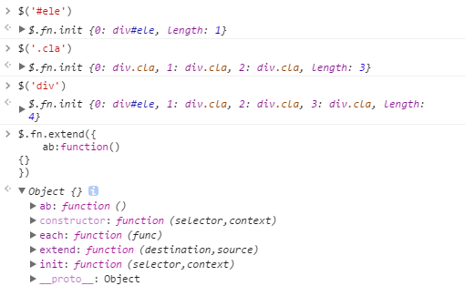
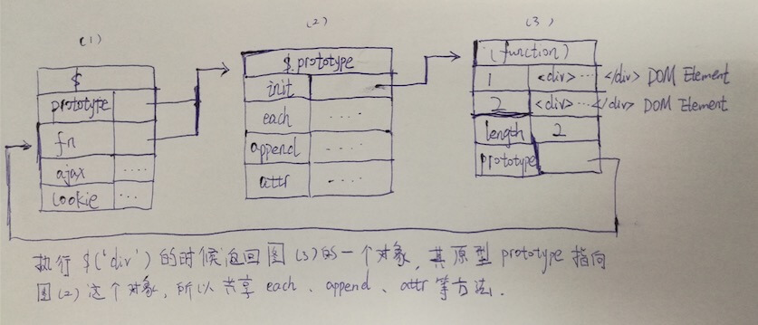

# JF
This is a JqueryFree javascript framework

#功能
时间：2016-9-13
+ 实现core.js(主要是原型继承$.fn.init.prototype=$.fn和extend函数的设计)
+ 支持id选择器、class选择器、标签选择器
+ 实现each函数

测试结果： 

时间：2016-9-14
+ 实现utils.js(包含数据类型判断函数、格式化日期、返回指定长度的随机字符串、对象深度克隆、数组去重、解 析URL等功能函数，通过$.extend函数附加在$上，而不是$.prototype上)
+ 添加core.js的原理图，如下：
+ 
